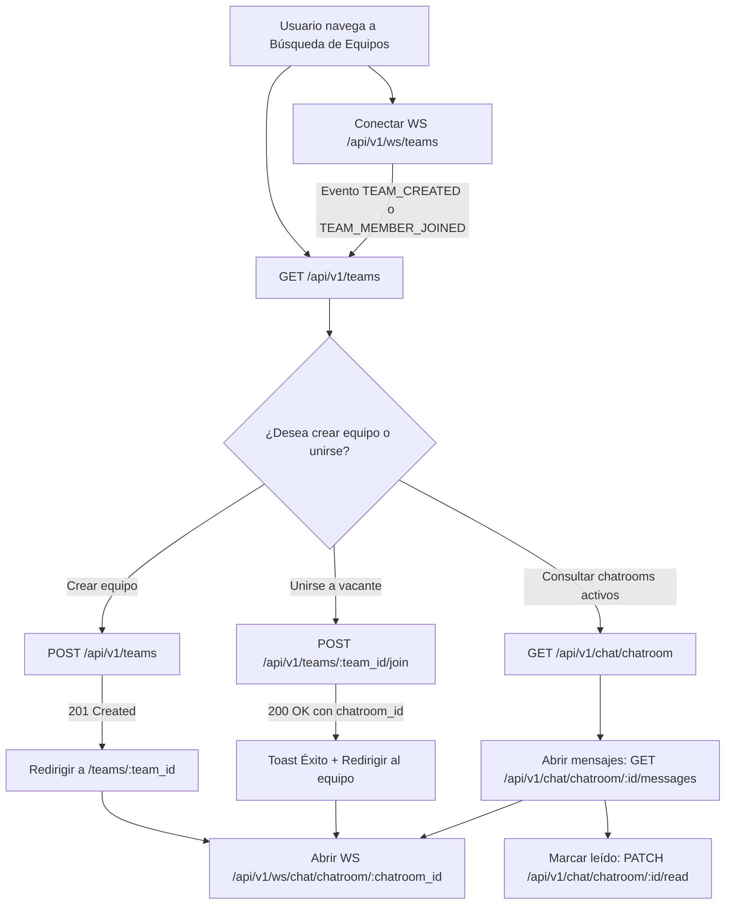

# Guía de Integración Frontend — Backend (Ganker API v2)

Esta guía documenta la integración de la API para el equipo de Frontend, cubriendo el ciclo de vida completo de **Equipos** (Creación, Búsqueda, Unión), **Conversaciones Privadas**, **Chatrooms Grupales** y canales en tiempo real mediante **WebSockets**.

---

## 1. Configuración General y URLs Base

- **HTTP Base URL:** `http://localhost:8000/api/v1`
- **WebSocket Base URL:** `ws://localhost:8000/api/v1/ws`

### Autenticación

- **Peticiones HTTP REST:** Incluir el token JWT en el encabezado `Authorization`:
  ```http
  Authorization: Bearer <access_token>
  ```
- **Conexiones WebSocket:** Pasar el token como query param en la URL de handshake:
  ```http
  ws://localhost:8000/api/v1/ws/...?...&token=<access_token>
  ```

### Formato de Errores del Backend

Cuando una petición falla con una regla de negocio (`DomainException`), la API responde con un cuerpo estándar:

```json
{
  "error": "Mensaje explicativo en español listo para mostrar al usuario"
}
```

- **HTTP 400:** Requisitos no cumplidos (rangos fuera de límite, región incompatible, etc.).
- **HTTP 404:** Recurso no encontrado (equipo inexistente, chatroom inexistente, etc.).
- **HTTP 409:** Conflicto de estado (usuario ya en un equipo activo, slot ocupado, etc.).
- **HTTP 422:** Error de validación de esquema Pydantic (campo obligatorio faltante, texto en blanco, etc.).

---

## 2. Diferenciación: Conversaciones Privadas vs Chatrooms Grupales

| Característica     | Conversaciones Privadas (1 a 1)          | Chatrooms Grupales (Equipos)                 |
| :----------------- | :--------------------------------------- | :------------------------------------------- |
| **Prefijo REST**   | `/api/v1/chat/conversations`             | `/api/v1/chat/chatroom`                      |
| **WebSocket**      | `/api/v1/ws/chat/conversations/{id}`     | `/api/v1/ws/chat/chatroom/{id}`              |
| **Participantes**  | Exactamente 2 jugadores                  | Múltiples jugadores (miembros del equipo)    |
| **Identificador**  | `conversation_id`                        | `chatroom_id` (equivale a `conversation_id`) |
| **Lectura (Read)** | Por mensaje (`is_read: bool`)            | Por miembro (`last_read_message_id`)         |
| **Separación**     | Si se consulta un chatroom aquí da `404` | Si se consulta un chat privado aquí da `404` |

---

## 3. Historias de Usuario — Equipos

### US1: Registrar un Equipo

#### Requisitos previos para el jugador creador

1. Debe tener un perfil de juego (`GameProfile`) para el videojuego elegido.
2. Debe tener asignado un rango en el rol que va a ocupar (`creator_game_role_id`).
3. El rango del jugador debe estar dentro del intervalo `[min_rank_id, max_rank_id]`.
4. El jugador **no** debe formar parte activa de otro equipo.

#### Petición HTTP

- **Método:** `POST`
- **URL:** `/api/v1/teams`
- **Headers:** `Authorization: Bearer <token>`
- **Body:**

```json
{
  "name": "Los Vengadores",
  "description": "Buscamos subir a Diamante en ranked",
  "icon_url": "/media/teams/vengadores.png",
  "allow_other_regions": false,
  "videogame_id": 1,
  "region_id": 2,
  "min_rank_id": 3,
  "max_rank_id": 5,
  "creator_game_role_id": 1,
  "vacant_game_role_ids": [2, 3, 4]
}
```

> **Nota sobre región:** Si `region_id` es `null`, `allow_other_regions` **debe** ser `true` obligatoriamente.

#### Respuesta Exitosa (`HTTP 201 Created` - `TeamSummaryResponse`)

```json
{
  "team_id": 10,
  "team_name": "Los Vengadores",
  "description": "Buscamos subir a Diamante en ranked",
  "icon_url": "/media/teams/vengadores.png",
  "is_active": true,
  "conversation_id": 45,
  "player_count": 1,
  "max_players": 4,
  "vacant_slots": 3,
  "representative_rank": {
    "rank_id": 4,
    "name": "Oro",
    "icon_url": "/media/games/ranks/oro.png",
    "average_value": 1000.0
  },
  "is_member": true,
  "is_leader": true,
  "join_eligibility": {
    "can_join": false,
    "reason": "Ya sos miembro de este equipo"
  },
  "videogame_id": 1,
  "videogame_name": "Valorant",
  "region_id": 2,
  "region_name": "LAS",
  "min_rank_id": 3,
  "min_rank_name": "Plata",
  "min_rank_value": 500,
  "max_rank_id": 5,
  "max_rank_name": "Platino",
  "max_rank_value": 1500,
  "allow_other_regions": false,
  "members": [
    {
      "team_member_role_id": 31,
      "is_vacant": false,
      "is_leader": true,
      "user_id": 1,
      "username": "agustin",
      "name": "Agustin Perez",
      "icon_url": "/media/users/agustin.png",
      "active_game_profile": { ... }
    },
    {
      "team_member_role_id": 32,
      "is_vacant": true,
      "is_leader": false,
      "user_id": null,
      "username": "Libre",
      "name": "Libre",
      "icon_url": "/media/games/roles/controller.png",
      "active_game_profile": { ... }
    }
  ]
}
```

#### Flujo Frontend Post-Creación

1. Guardar `team_id` y `conversation_id`.
2. Redirigir al usuario a la vista de su equipo (`/teams/${team_id}`).
3. El acceso al chatroom queda automáticamente habilitado bajo `conversation_id`.

---

### Endpoints de Consulta de Equipo

- **Consultar mi equipo activo:**
  - `GET /api/v1/teams/me`
  - Devuelve el `TeamSummaryResponse` del equipo activo del usuario, o `null` si no pertenece a ningún equipo.
- **Consultar equipo por ID:**
  - `GET /api/v1/teams/{team_id}`
  - Devuelve el `TeamSummaryResponse` con la información del equipo y la elegibilidad calculada para el usuario autenticado.

---

### US2: Incorporarse a un Equipo

#### Selección de la vacante en la UI

Al renderizar los miembros del equipo, iterar la lista `members`:

- Si `member.is_vacant === true`, mostrar la tarjeta de slot disponible con el rol requerido y su botón **"Unirse al equipo"**.
- **Importante:** El ID que se debe enviar es `member.team_member_role_id` (el ID único del slot), **no** el ID del rol de juego.

#### Petición HTTP

- **Método:** `POST`
- **URL:** `/api/v1/teams/{team_id}/join`
- **Headers:** `Authorization: Bearer <token>`
- **Body:**

```json
{
  "target_team_member_role_id": 32
}
```

#### Respuesta Exitosa (`HTTP 200 OK` - `JoinTeamResponse`)

```json
{
  "status": "success",
  "message": "Te uniste al equipo Los Vengadores",
  "chatroom_id": 45,
  "data": {
    "team_id": 10,
    "team_name": "Los Vengadores",
    "player_count": 2,
    "max_players": 4,
    "vacant_slots": 2,
    "conversation_id": 45,
    "is_member": true,
    "is_leader": false,
    ...
  }
}
```

#### Flujo Frontend Post-Unión

1. Mostrar notificación/toast de éxito con `response.message`.
2. Redirigir o actualizar la pantalla con `response.data`.
3. Conectar al usuario al chatroom utilizando `response.chatroom_id`.

---

### US3: Buscar y Filtrar Equipos

#### Petición HTTP

- **Método:** `GET`
- **URL:** `/api/v1/teams`
- **Headers:** `Authorization: Bearer <token>`
- **Query Parameters (todos opcionales):**

| Parámetro      | Tipo     | Descripción                                                      |
| :------------- | :------- | :--------------------------------------------------------------- |
| `videogame_id` | `int`    | Filtra equipos de un juego específico.                           |
| `region_id`    | `int`    | Filtra por región configurada en el equipo.                      |
| `rank_id`      | `int`    | Filtra equipos cuyo rango admita este nivel de rango.            |
| `vacant_slots` | `int`    | Mínimo de vacantes disponibles (ej. `vacant_slots=2`).           |
| `role_id`      | `int`    | Filtra equipos que tengan un slot libre con este rol específico. |
| `search`       | `string` | Búsqueda por texto coincidente en nombre o descripción.          |
| `page`         | `int`    | Número de página (default: `1`).                                 |
| `size`         | `int`    | Tamaño de página (default: `20`, máx: `100`).                    |

#### Limpieza de filtros

Para resetear los filtros, simplemente volver a consultar:

```http
GET /api/v1/teams?page=1&size=20
```

#### Cómo renderizar cada tarjeta de equipo (`TeamSummaryResponse`)

1. **Avatar del equipo:** `team.icon_url` (si viene null, usar default del front).
2. **Contador de miembros:** `${team.player_count}/${team.max_players}` (ej. `3/5`).
3. **Vacantes:** `team.vacant_slots`.
4. **Rango Representativo de la sala:** Mostrar `team.representative_rank.name` y `team.representative_rank.icon_url`.
5. **Botón "Unirse al equipo":**
   - Inspeccionar `team.join_eligibility`:
     - Si `can_join === true`: habilitar el botón "Unirse".
     - Si `can_join === false`: deshabilitar o mostrar tooltip/alerta con `team.join_eligibility.reason` (ej. _"Ya formás parte de otro equipo activo"_, _"El equipo no permite jugadores de la región BR"_, _"Tu rango Platino supera el máximo Oro permitido"_).

---

## 4. Chatrooms Grupales (Chat de Equipo)

### A. Listar Mis Chatrooms

Devuelve todos los chatrooms de equipos a los que pertenece el usuario.

- **Método:** `GET`
- **URL:** `/api/v1/chat/chatroom`
- **Headers:** `Authorization: Bearer <token>`
- **Respuesta (`ChatroomSummaryResponse`):**

```json
{
  "chatrooms": [
    {
      "chatroom_id": 45,
      "team_id": 10,
      "name": "Chat del equipo Los Vengadores",
      "icon_url": "/media/teams/vengadores.png",
      "member_count": 3,
      "last_message": {
        "content": "¿A qué hora jugamos hoy?",
        "timestamp": "2026-10-05T14:30:00",
        "sender_id": 2,
        "sender_username": "janedoe"
      },
      "unread_count": 2
    }
  ]
}
```

### B. Obtener Historial de Mensajes

- **Método:** `GET`
- **URL:** `/api/v1/chat/chatroom/{chatroom_id}/messages?page=1&size=30`
- **Headers:** `Authorization: Bearer <token>`
- **Respuesta (`GetChatroomMessagesResponse`):**

```json
{
  "messages": [
    {
      "type": "NEW_CHATROOM_MESSAGE_NOTIFICATION",
      "message_id": 102,
      "chatroom_id": 45,
      "sender_id": 2,
      "sender_username": "janedoe",
      "sender_name": "Jane Doe",
      "sender_icon_url": "/media/users/janedoe.png",
      "content": "Buenas gente!",
      "timestamp": "2026-10-05T14:28:00"
    }
  ]
}
```

### C. Marcar Chatroom como Leído

- **Método:** `PATCH`
- **URL:** `/api/v1/chat/chatroom/{chatroom_id}/read`
- **Headers:** `Authorization: Bearer <token>`
- **Respuesta:**

```json
{
  "status": "ok",
  "messages_marked": 2
}
```

---

## 5. WebSockets en Tiempo Real

### A. WebSocket del Chatroom Grupal

Permite enviar y recibir mensajes de texto en tiempo real dentro del equipo.

- **URL:** `ws://localhost:8000/api/v1/ws/chat/chatroom/{chatroom_id}?token=<access_token>`
- **Validación inicial:** Si el usuario no pertenece al equipo, la conexión se cierra inmediatamente con código `1008 (Policy Violation)`.

#### Enviar Mensaje (Cliente -> Servidor)

Enviar un payload en formato JSON string:

```json
{
  "content": "Nos conectamos en Discord?"
}
```

#### Recibir Mensaje (Servidor -> Cliente)

Se recibe en tiempo real el mensaje con los datos del remitente para pintar en pantalla:

```json
{
  "type": "NEW_CHATROOM_MESSAGE_NOTIFICATION",
  "message_id": 103,
  "chatroom_id": 45,
  "sender_id": 1,
  "sender_username": "agustin",
  "sender_name": "Agustin Perez",
  "sender_icon_url": "/media/users/agustin.png",
  "content": "Nos conectamos en Discord?",
  "timestamp": "2026-10-05T14:32:00"
}
```

---

### B. WebSocket del Feed de Equipos (Lobby)

Escucha eventos globales para actualizar en vivo el listado de búsqueda de equipos sin recargar la página.

- **URL:** `ws://localhost:8000/api/v1/ws/teams` (no requiere autenticación para observar salas).
- **Eventos recibidos:**
  1. `TEAM_CREATED`: Un nuevo equipo fue creado.
     ```json
     {
       "type": "TEAM_CREATED",
       "data": {/* TeamSummaryResponse público */}
     }
     ```
  2. `TEAM_MEMBER_JOINED`: Un jugador ocupó una vacante en un equipo.
     ```json
     {
       "type": "TEAM_MEMBER_JOINED",
       "data": {/* TeamSummaryResponse actualizado */}
     }
     ```

---

### C. WebSocket de Notificaciones Personales

Canal de notificaciones push directas para el usuario (mensajes no leídos, avisos de unión a equipo, etc.).

- **URL:** `ws://localhost:8000/api/v1/ws/notifications?token=<access_token>`
- **Eventos recibidos relevantes:**
  - `TEAM_JOINED`: Confirmación personal al unirse a un equipo.
    ```json
    {
      "type": "TEAM_JOINED_NOTIFICATION",
      "team_id": 10,
      "team_name": "Los Vengadores",
      "chatroom_id": 45,
      "message": "Te uniste al equipo Los Vengadores"
    }
    ```
  - `TEAM_NEW_MEMBER`: Notificación a los integrantes de un equipo cuando alguien nuevo se unió.
    ```json
    {
      "type": "TEAM_NEW_MEMBER_NOTIFICATION",
      "team_id": 10,
      "team_name": "Los Vengadores",
      "chatroom_id": 45,
      "user_id": 2,
      "username": "janedoe",
      "message": "janedoe se unió al equipo"
    }
    ```
  - `NEW_CHATROOM_MESSAGE_NOTIFICATION`: Llega si un compañero escribe en el chatroom y el usuario tiene el WebSocket del chatroom cerrado.
    ```json
    {
      "type": "NEW_CHATROOM_MESSAGE_NOTIFICATION",
      "conversation_id": 45,
      "sender_id": 1,
      "content": "Nos conectamos en Discord?",
      "timestamp": "2026-10-05T14:32:00"
    }
    ```

---

## 6. Diagrama de Flujo Resumen (Frontend)


