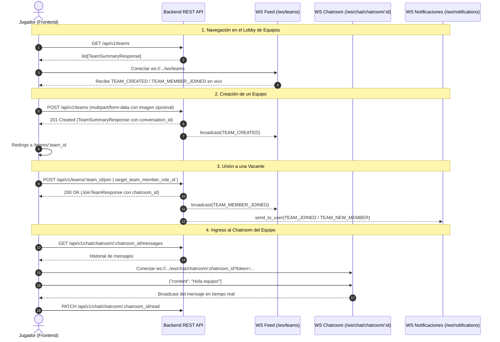

# Guía de Integración Frontend — Backend (Ganker API v3)

Esta guía documenta la integración de la API para el equipo de Frontend. Refleja los **últimos cambios realizados en el backend**, incluyendo la transición a `multipart/form-data` para subida de imágenes, la nueva estructura de objetos anidados en las respuestas de equipos (`TeamSummaryResponse`), los endpoints de **Chatrooms Grupales**, **Equipos** y los canales en tiempo real mediante **WebSockets**.

---

## 📌 Resumen de Cambios Principales (Changelog v2 ➔ v3)

Si ya estabas integrando la versión anterior, estos son los **breaking changes** más importantes:

1. **Creación de Equipos (`POST /api/v1/teams`):**
   - **Cambio de Content-Type:** Ya **NO** se envía `application/json`. Ahora se envía **`multipart/form-data`**.
   - **Subida directa de archivos:** Se eliminó el campo de texto `icon_url` del request. Ahora se envía un archivo real mediante el campo `team_icon` (tipo File/Blob, opcional). Si no se adjunta archivo, el backend asigna automáticamente el ícono por defecto (`/media/teams/icons/default_icon.png`).
   - **Array de vacantes en FormData:** El campo `vacant_game_role_ids` debe enviarse como valores repetidos en el `FormData` (por ejemplo, `formData.append('vacant_game_role_ids', id)`).

2. **Estructura de Respuesta de Equipos (`TeamSummaryResponse`):**
   - **Campos del consultante agrupados:** `is_member`, `is_leader` y `join_eligibility` ya **no** están sueltos en la raíz. Ahora se encuentran dentro del objeto anidado `consultant_player_info` (o `null` en eventos de WebSocket públicos).
   - **Objetos anidados de catálogo:**
     - `videogame`: ahora es un objeto `{ videogame_id, name }` (antes `videogame_id` y `videogame_name`).
     - `region`: ahora es un objeto `{ region_id, region_name }` (antes `region_id` y `region_name`).
     - `min_rank` y `max_rank`: ahora son objetos `{ rank_id, name, value, icon_url }` (antes campos planos `min_rank_id`, `min_rank_name`, etc.).
   - **Cálculo de vacantes:** Se retiró el campo redundante `vacant_slots` de la raíz del JSON. En el frontend se calcula directamente como:
     ```typescript
     const vacantSlots = team.max_players - team.player_count;
     // o alternativamente:
     const vacantSlots = team.members.filter((m) => m.is_vacant).length;
     ```

3. **Feed de Equipos por WebSocket:**
   - El evento `TEAM_CREATED` y `TEAM_MEMBER_JOINED` emitido por `/api/v1/ws/teams` ahora envía el payload público sin `consultant_player_info` para evitar filtrar el estado del creador/jugador que ejecutó la acción.

---

## 1. Configuración General y URLs Base

- **HTTP Base URL:** `http://localhost:8000/api/v1`
- **WebSocket Base URL:** `ws://localhost:8000/api/v1/ws`

### Autenticación

- **Peticiones HTTP REST:**
  ```http
  Authorization: Bearer <access_token>
  ```
- **Conexiones WebSocket:** Pasar el token como query parameter en el handshake:
  ```http
  ws://localhost:8000/api/v1/ws/...?...&token=<access_token>
  ```

### Formato de Errores de Negocio (`DomainException`)

Cuando una acción viola una regla de negocio, el backend responde con un JSON uniforme:

```json
{
  "error": "Mensaje explicativo en español listo para mostrar en un toast o alerta"
}
```

- **HTTP 400 (Bad Request):** Rango fuera del límite permitido, región incompatible, videojuego no coincide, etc.
- **HTTP 404 (Not Found):** Equipo no encontrado, chatroom no encontrado, etc.
- **HTTP 409 (Conflict):** El usuario ya pertenece a un equipo activo, el slot seleccionado ya está ocupado, etc.
- **HTTP 422 (Unprocessable Entity):** Error de validación de formulario/Pydantic (campos obligatorios vacíos, strings en blanco, etc.).

---

## 2. Diferenciación: Conversaciones Privadas vs Chatrooms Grupales

| Característica        | Conversaciones Privadas (1 a 1)             | Chatrooms Grupales (Equipos)                             |
| :-------------------- | :------------------------------------------ | :------------------------------------------------------- |
| **Prefijo REST**      | `/api/v1/chat/conversations`                | `/api/v1/chat/chatroom`                                  |
| **WebSocket**         | `/api/v1/ws/chat/conversations/{id}`        | `/api/v1/ws/chat/chatroom/{id}`                          |
| **Participantes**     | Exactamente 2 jugadores                     | Múltiples jugadores (miembros del equipo)                |
| **Identificador**     | `conversation_id`                           | `chatroom_id` (numérico, coincide con `conversation_id`) |
| **Estado de Lectura** | Por mensaje (`is_read: bool`)               | Por miembro individual (`last_read_message_id`)          |
| **Aislamiento**       | Si se consulta un chat grupal aquí da `404` | Si se consulta un chat privado aquí da `404`             |

---

## 3. Flujo de Equipos (Teams)

### A. Registrar un Equipo (US1)

- **Método:** `POST`
- **URL:** `/api/v1/teams`
- **Headers:**
  - `Authorization: Bearer <token>`
  - _(Si usas `fetch` o `axios` pasando `FormData`, **no** configures `Content-Type` manualmente para que el navegador configure el boundary correcto)._
- **Body (`multipart/form-data`):**

| Campo                  | Tipo          | Obligatorio | Descripción                                                                                   |
| :--------------------- | :------------ | :---------- | :-------------------------------------------------------------------------------------------- |
| `name`                 | `string`      | Sí          | Nombre del equipo (min 1, max 100 caracteres no vacíos).                                      |
| `description`          | `string`      | No          | Mensaje o descripción de búsqueda para la sala (max 500 caracteres).                          |
| `allow_other_regions`  | `boolean`     | Sí          | `true` o `false` (si `region_id` es null, debe ser `true`).                                   |
| `videogame_id`         | `int`         | Sí          | ID del videojuego.                                                                            |
| `region_id`            | `int`         | No          | ID de la región (o omitir si no tiene región fija).                                           |
| `min_rank_id`          | `int`         | Sí          | ID del rango mínimo requerido (debe ser `<=` al máximo).                                      |
| `max_rank_id`          | `int`         | Sí          | ID del rango máximo requerido.                                                                |
| `creator_game_role_id` | `int`         | Sí          | ID del rol que ocupará el creador en el equipo.                                               |
| `vacant_game_role_ids` | `list[int]`   | Sí          | Lista de IDs de roles para las vacantes buscadas (mínimo 1).                                  |
| `team_icon`            | `File / Blob` | No          | Archivo de imagen del avatar/ícono del equipo. Si se omite, se asigna el default del backend. |

#### Ejemplo en JavaScript / TypeScript (Frontend):

```typescript
const formData = new FormData();
formData.append("name", "Los Vengadores");
formData.append("description", "Buscamos subir a Diamante en ranked");
formData.append("allow_other_regions", "false");
formData.append("videogame_id", "1");
formData.append("region_id", "2");
formData.append("min_rank_id", "3");
formData.append("max_rank_id", "5");
formData.append("creator_game_role_id", "1");

// Vacantes: añadir cada ID con la misma clave
formData.append("vacant_game_role_ids", "2");
formData.append("vacant_game_role_ids", "3");

// Archivo opcional (desde un <input type="file" />)
if (imageFileInput.files[0]) {
  formData.append("team_icon", imageFileInput.files[0]);
}

const response = await fetch("http://localhost:8000/api/v1/teams", {
  method: "POST",
  headers: {
    Authorization: `Bearer ${token}`,
  },
  body: formData,
});
const teamData: TeamSummaryResponse = await response.json();
```

#### Respuesta Exitosa (`HTTP 201 Created` - `TeamSummaryResponse`):

```json
{
  "team_id": 10,
  "team_name": "Los Vengadores",
  "description": "Buscamos subir a Diamante en ranked",
  "icon_url": "/media/teams/icons/a1b2c3d4_vengadores.png",
  "is_active": true,
  "conversation_id": 45,
  "player_count": 1,
  "max_players": 3,
  "allow_other_regions": false,
  "videogame": {
    "videogame_id": 1,
    "name": "Valorant"
  },
  "region": {
    "region_id": 2,
    "region_name": "LAS"
  },
  "min_rank": {
    "rank_id": 3,
    "name": "Plata",
    "value": 500,
    "icon_url": "/media/games/ranks/plata.png"
  },
  "max_rank": {
    "rank_id": 5,
    "name": "Platino",
    "value": 1500,
    "icon_url": "/media/games/ranks/platino.png"
  },
  "representative_rank": {
    "rank_id": 4,
    "name": "Oro",
    "icon_url": "/media/games/ranks/oro.png",
    "average_value": 1000.0
  },
  "consultant_player_info": {
    "is_member": true,
    "is_leader": true,
    "join_eligibility": {
      "can_join": false,
      "reason": "Ya sos miembro de este equipo"
    }
  },
  "members": [
    {
      "team_member_role_id": 31,
      "is_vacant": false,
      "is_leader": true,
      "user_id": 1,
      "username": "agustin",
      "name": "Agustin Perez",
      "icon_url": "/media/users/agustin.png",
      "active_game_profile": {
        "region_name": "LAS",
        "active_role_profile": {
          "role_id": 1,
          "role_name": "Duelista",
          "rank_name": "Oro",
          "rank_icon_url": "/media/games/ranks/oro.png"
        }
      }
    },
    {
      "team_member_role_id": 32,
      "is_vacant": true,
      "is_leader": false,
      "user_id": null,
      "username": "Libre",
      "name": "Libre",
      "icon_url": "/media/games/roles/controller.png",
      "active_game_profile": {
        "region_name": "LAS",
        "active_role_profile": {
          "role_id": 2,
          "role_name": "Controlador",
          "rank_name": "",
          "rank_icon_url": "/media/ranks/empty_rank_icon.png"
        }
      }
    }
  ]
}
```

---

### B. Consultar Equipos

#### 1. Consultar mi equipo activo actual

- **Método:** `GET`
- **URL:** `/api/v1/teams/me`
- **Headers:** `Authorization: Bearer <token>`
- **Respuesta:** Devuelve el `TeamSummaryResponse` del equipo al que pertenece el usuario, o `null` si no está en ningún equipo.

#### 2. Consultar un equipo por ID

- **Método:** `GET`
- **URL:** `/api/v1/teams/{team_id}`
- **Headers:** `Authorization: Bearer <token>`
- **Respuesta:** Devuelve el `TeamSummaryResponse` con `consultant_player_info` calculado para el usuario autenticado.

---

### C. Incorporarse a un Equipo (US2)

#### Selección de la vacante en la interfaz

Al renderizar `team.members`, cada elemento contiene:

- `member.is_vacant`: booleano (`true` si el espacio está libre).
- `member.team_member_role_id`: **este es el ID que se debe enviar** al unirse. (No enviar el ID de rol).

#### Petición HTTP

- **Método:** `POST`
- **URL:** `/api/v1/teams/{team_id}/join`
- **Headers:** `Authorization: Bearer <token>`, `Content-Type: application/json`
- **Body:**

```json
{
  "target_team_member_role_id": 32
}
```

#### Respuesta Exitosa (`HTTP 200 OK` - `JoinTeamResponse`):

```json
{
  "status": "success",
  "message": "Te uniste al equipo Los Vengadores",
  "chatroom_id": 45,
  "data": {
    /* TeamSummaryResponse actualizado del equipo */
    "team_id": 10,
    "player_count": 2,
    "max_players": 3,
    "conversation_id": 45,
    "consultant_player_info": {
      "is_member": true,
      "is_leader": false,
      "join_eligibility": {
        "can_join": false,
        "reason": "Ya sos miembro de este equipo"
      }
    },
    "members": [ ... ]
  }
}
```

---

### D. Buscar y Filtrar Equipos (US3)

- **Método:** `GET`
- **URL:** `/api/v1/teams`
- **Headers:** `Authorization: Bearer <token>`
- **Query Parameters (opcionales):**

| Parámetro      | Tipo     | Descripción                                                              |
| :------------- | :------- | :----------------------------------------------------------------------- |
| `videogame_id` | `int`    | Filtra por ID de videojuego.                                             |
| `region_id`    | `int`    | Filtra por ID de región.                                                 |
| `rank_id`      | `int`    | Filtra equipos cuyo rango admita este nivel de rango específico.         |
| `vacant_slots` | `int`    | Mínimo de vacantes libres requeridas (ej: `vacant_slots=2`).             |
| `role_id`      | `int`    | Filtra equipos que tengan al menos una vacante para este rol específico. |
| `search`       | `string` | Búsqueda por texto (coincidencia parcial en nombre o descripción).       |
| `page`         | `int`    | Número de página (default: `1`).                                         |
| `size`         | `int`    | Cantidad por página (default: `20`, máx: `100`).                         |

#### Cómo utilizar `consultant_player_info` en la UI de cada tarjeta de equipo:

En cada equipo del listado:

```typescript
const { can_join, reason } = team.consultant_player_info?.join_eligibility ?? {
  can_join: true,
  reason: null,
};

if (!can_join) {
  // Deshabilitar botón 'Unirse' y mostrar 'reason' en tooltip o badge
  // Ejemplos de reason:
  // "Ya formás parte de otro equipo activo"
  // "El equipo no permite jugadores de la región BR"
  // "Tu rango no cumple el requisito mínimo/máximo"
} else {
  // Habilitar botón 'Unirse'
}
```

#### Cómo mostrar las vacantes disponibles:

```typescript
const vacantesLibres = team.max_players - team.player_count;
// Mostrar badge: "2 cupos disponibles" o "3/5 jugadores"
```

---

## 4. Chatrooms Grupales (Chat del Equipo)

### A. Listar Mis Chatrooms

- **Método:** `GET`
- **URL:** `/api/v1/chat/chatroom`
- **Headers:** `Authorization: Bearer <token>`
- **Respuesta (`ChatroomSummaryResponse`):**

```json
{
  "chatrooms": [
    {
      "chatroom_id": 45,
      "team_id": 10,
      "name": "Chat del equipo Los Vengadores",
      "icon_url": "/media/teams/icons/a1b2c3d4_vengadores.png",
      "member_count": 3,
      "last_message": {
        "content": "¿A qué hora arrancamos hoy?",
        "timestamp": "2026-10-06T00:15:00",
        "sender_id": 2,
        "sender_username": "janedoe"
      },
      "unread_count": 4
    }
  ]
}
```

### B. Obtener Historial de Mensajes del Chatroom

- **Método:** `GET`
- **URL:** `/api/v1/chat/chatroom/{chatroom_id}/messages?page=1&size=30`
- **Headers:** `Authorization: Bearer <token>`
- **Respuesta (`GetChatroomMessagesResponse`):**

```json
{
  "messages": [
    {
      "type": "NEW_CHATROOM_MESSAGE_NOTIFICATION",
      "message_id": 102,
      "chatroom_id": 45,
      "sender_id": 2,
      "sender_username": "janedoe",
      "sender_name": "Jane Doe",
      "sender_icon_url": "/media/users/janedoe.png",
      "content": "Buenas gente!",
      "timestamp": "2026-10-06T00:10:00"
    }
  ]
}
```

### C. Marcar Chatroom como Leído

- **Método:** `PATCH`
- **URL:** `/api/v1/chat/chatroom/{chatroom_id}/read`
- **Headers:** `Authorization: Bearer <token>`
- **Respuesta:**

```json
{
  "status": "ok",
  "messages_marked": 4
}
```

---

## 5. WebSockets en Tiempo Real

### A. WebSocket del Chatroom Grupal

- **URL:** `ws://localhost:8000/api/v1/ws/chat/chatroom/{chatroom_id}?token=<access_token>`
- Si el usuario no pertenece al equipo, la conexión se rechaza con código `1008 (Policy Violation)`.

#### Enviar Mensaje (Frontend ➔ Backend)

Enviar texto en formato JSON:

```json
{
  "content": "Nos conectamos en Discord?"
}
```

#### Recibir Mensaje (Backend ➔ Frontend)

Se recibe en tiempo real el mensaje formateado:

```json
{
  "type": "NEW_CHATROOM_MESSAGE_NOTIFICATION",
  "message_id": 103,
  "chatroom_id": 45,
  "sender_id": 1,
  "sender_username": "agustin",
  "sender_name": "Agustin Perez",
  "sender_icon_url": "/media/users/agustin.png",
  "content": "Nos conectamos en Discord?",
  "timestamp": "2026-10-06T00:16:00"
}
```

---

### B. WebSocket del Feed de Equipos (Lobby / Búsqueda)

- **URL:** `ws://localhost:8000/api/v1/ws/teams`
- _(No requiere autenticación para observar salas)._
- **Eventos recibidos:**
  1. `TEAM_CREATED`: Un usuario creó un nuevo equipo.
     ```json
     {
       "type": "TEAM_CREATED",
       "data": {/* TeamSummaryResponse público sin consultant_player_info */}
     }
     ```
  2. `TEAM_MEMBER_JOINED`: Alguien se unió a una vacante.
     ```json
     {
       "type": "TEAM_MEMBER_JOINED",
       "data": {/* TeamSummaryResponse público sin consultant_player_info */}
     }
     ```
  - **Tip para el Frontend:** Cuando recibas estos eventos, podés actualizar directamente la tarjeta correspondiente en el estado de la lista o disparar una re-consulta a `GET /api/v1/teams` para recalcular la elegibilidad personal.

---

### C. WebSocket de Notificaciones Personales

- **URL:** `ws://localhost:8000/api/v1/ws/notifications?token=<access_token>`
- **Eventos recibidos relevantes:**
  - `TEAM_JOINED_NOTIFICATION`: Confirmación personal al unirse a un equipo.
    ```json
    {
      "type": "TEAM_JOINED_NOTIFICATION",
      "team_id": 10,
      "team_name": "Los Vengadores",
      "chatroom_id": 45,
      "message": "Te uniste al equipo Los Vengadores"
    }
    ```
  - `TEAM_NEW_MEMBER_NOTIFICATION`: Aviso al resto de los integrantes cuando un nuevo jugador ingresa al equipo.
    ```json
    {
      "type": "TEAM_NEW_MEMBER_NOTIFICATION",
      "team_id": 10,
      "team_name": "Los Vengadores",
      "chatroom_id": 45,
      "user_id": 2,
      "username": "janedoe",
      "message": "janedoe se unió al equipo"
    }
    ```
  - `NEW_CHATROOM_MESSAGE_NOTIFICATION`: Llega si un compañero escribe en el chatroom del equipo mientras el usuario tiene el WebSocket del chatroom cerrado.

---

## 6. Diagrama de Navegación y Conexiones


